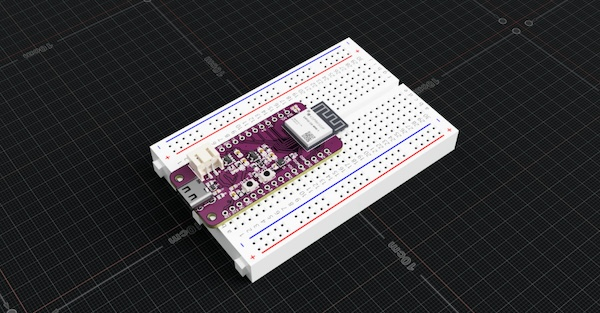

ThingPulse ePulse Feather C6
=================


Sample projects for [ThingPulse ePulse Feather C6](https://thingpulse.com/products/epulse-feather-c6/)
 

# Sample Projects

To build and run these sample projects follow these steps:
 1. Install VS Code and install [Platformio](https://platformio.org/install/ide?install=vscode)
 2. Checkout this repository and open it in VS Code
 3. Select the sample project by clicking on env section in the footer:
 
 4. Build and flash the sample by clicking on the right arrow in VS Code footer:
 
 5. Turn on serial monitor by clicking on the plug symbol:
 

## Fuel Gauge Simple

This example shows how to use the MAX17048 fuel gauge chip. 

1. Preparation: connect a LiPo battery to the ePulse Feather C6. Make sure polarity of the battery
is correct-
2. Select `env:fuel-gauge-simple` to run this example. The `ESP32-C6` connects to the `MAX17048` chip
and reads battery voltage, state of charge (SoC) and change rate

### Links
* [MAX 17048 DataSheet](https://www.analog.com/media/en/technical-documentation/data-sheets/max17048-max17049.pdf)

## Fuel Gauge WiFi

This example shows how to use the MAX17048 fuel gauge chip. In addition to the previous example this code sends
the battery voltage and the SoC to the given HTTP server. We used a node-red instance with http node to receive
the values

1. Preparation: connect a LiPo battery to the ePulse Feather C6. Make sure polarity of the battery
is correct-
2. Select `env:fuel-gauge-wifi` to run this example. The `ESP32-C6` connects to the `MAX17048` chip
and reads battery voltage, state of charge (SoC) and change rate
3. Adjust WiFi ssid and password in `main-fuel-gauge-wifi.cpp`
4. Adjust host and port in the same file
5. Setup http server to receive GET requests

Here is an example flow of node red. It receives requests under /epulsec6, converts them and sends the message to influx:
 

Content of the `convert message` node
 ```js
let payload = {};

payload.vBat = Number(msg.req.query.voltage);
payload.soc = Number(msg.req.query.soc);

let values = payload;
let tags = {};
tags.name = "epulse feather c6";
msg.payload = [values, tags];
return msg;
```

